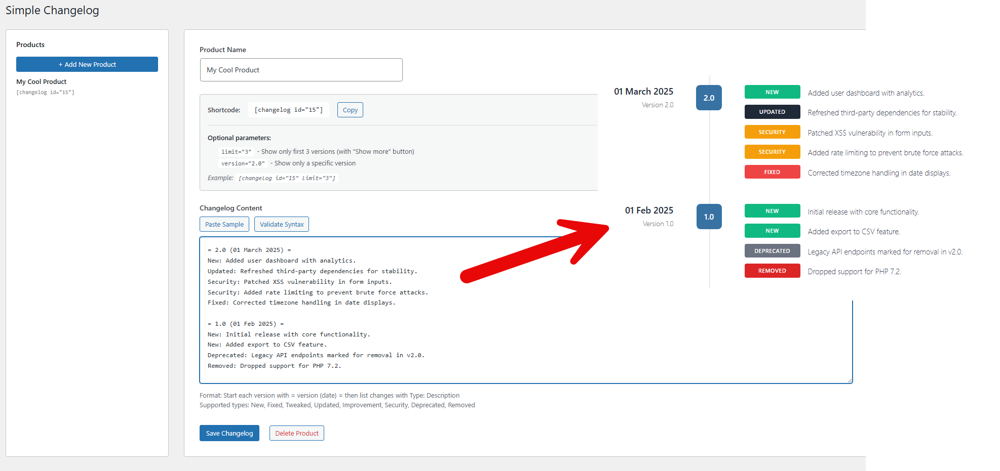

# Simple Changelog

A simple WordPress plugin to manage and display changelogs for your products with a beautiful timeline design.



## Features

- **Simple text-based editor** - No complex interfaces, just write your changelog
- **Beautiful timeline display** - Clean, modern frontend design
- **Multiple products** - Manage changelogs for different products
- **Shortcode support** - Easy embedding with `[changelog id="X"]`
- **Auto-updates** - Receive updates directly from GitHub

## Installation

1. Download the latest release
2. Upload to `/wp-content/plugins/`
3. Activate the plugin in WordPress

## Usage

### Admin

1. Go to **Changelog** in the WordPress admin menu
2. Click **Add New Product**
3. Enter your changelog using this format:

```
= 2.0 (01 March 2025) =
New: Added user dashboard with analytics.
Updated: Refreshed third-party dependencies.
Security: Patched XSS vulnerability in form inputs.
Fixed: Corrected timezone handling in date displays.

= 1.0 (01 Feb 2025) =
New: Initial release with core functionality.
```

### Supported Types

- `New` - New features
- `Fixed` - Bug fixes
- `Tweaked` - Minor adjustments
- `Updated` - Dependency updates
- `Improvement` - Enhancements
- `Security` - Security patches
- `Deprecated` - Features marked for removal
- `Removed` - Removed features

### Shortcode

```
[changelog id="1"]              // Show all versions
[changelog id="1" limit="3"]    // Show 3 versions + "Show more" button
[changelog id="1" version="2.0"] // Show specific version only
```

## Author

**Sven Bosau** - [pythonandvba.com](https://pythonandvba.com)

## License

GPL v2 or later
